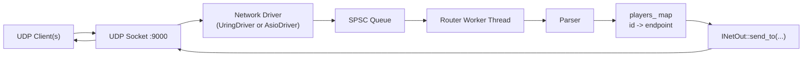

# Architecture Overview

## System Intent
`udp-uring-server` is a low-latency UDP fan-out server for real-time player telemetry.
It receives binary UDP packets, decodes them into a `Players` model, tracks sender endpoints by player id, and broadcasts updates to connected peers.

## Build-Time Platform Split
The project uses one executable target (`app`) with a platform-specific networking backend selected by CMake:

- Linux: `io_uring` backend (`src/net/uring_driver.cpp`) linked with `liburing`
- Non-Linux: Boost.Asio backend (`src/net/asio_driver.cpp`) linked with `Boost::headers`

Common logic (routing, parsing, models, queue) lives in headers under `include/`.

## Runtime Topology

## Request Flow
1. `main` builds `ServerConfig{port=9000, threads=4}`, constructs `Server`, then calls `start()`.
2. `Server::init()` creates a UDP socket, enables `SO_REUSEADDR` + `SO_REUSEPORT`, and binds `0.0.0.0:<port>`.
3. `Server::start()` chooses backend:
4. Linux path: `UringDriver(fd).start()`
5. Non-Linux path: `AsioDriver(port).start()`
6. Driver receives datagrams and converts each to `PacketView { peer, peer_len, bytes }`.
7. Driver forwards packet to `Router`.
8. `Router` decodes with `Parser` and dispatches by `Players.op`:
9. `op=0` register endpoint, no rebroadcast
10. `op=1` player update, broadcast to all known peers
11. `op=2` update message, broadcast to all known peers

## Core Components

### `Server` (`include/net/server.hpp`, `src/net/server.cpp`)
- Owns startup configuration (`port`, `threads`)
- Initializes and binds UDP socket
- Selects platform driver and starts event loop

### `UringDriver` (`include/net/uring_driver.hpp`, `src/net/uring_driver.cpp`)
- Implements `INetOut` for outbound sends
- Uses `io_uring` completions for receive/send
- Preposts receives on two UDP slots (`kUdpSlots = 2`)
- Uses fixed send slot pool (`kSendSlots = 256`) to avoid allocation on hot path
- Handles SIGINT to stop loop

### `AsioDriver` (`include/net/asio_driver.hpp`, `src/net/asio_driver.cpp`)
- Implements `INetOut` with `async_send_to`
- Uses `async_receive_from` loop and `io_context::run()`
- Stops on SIGINT/SIGTERM (non-Windows)
- Copies send payload into shared buffer for async lifetime safety

### `Router` (`include/core/router.hpp`)
- Owns parser and player endpoint state (`unordered_map<uint32_t, PeerInfo>`)
- Runs a dedicated worker thread
- Receives packet events through `SPSC<QueuedPacket>` (`capacity = 1024`)
- Applies op-based routing and fan-out via `INetOut`

### `Parser` (`include/core/parser.hpp`)
- Accepts two wire payload sizes:
- 24-byte layout (matches `Players` struct layout)
- 21-byte packed layout (size field starts at offset 17)
- Also accepts optional 8-byte header (`Header`) and extracts payload by `len`
- Attempts both little- and big-endian decode and chooses the most plausible result based on op/range sanity checks

### Data Model (`include/models/net.hpp`)
- `PacketView`: sender endpoint + raw bytes
- `PeerInfo`: endpoint cache for fan-out
- `Players`: decoded packet (`op`, `id`, `x`, `y`, `color`, `size`)

## Threading and Concurrency
- Minimum two active threads during runtime:
- Event loop thread (io_uring wait loop or Asio `io_context`)
- Router worker thread
- Driver thread is producer into SPSC queue; router thread is consumer.
- `players_` state is only mutated/read on router worker thread, avoiding explicit locks.
- Backpressure policy is drop-on-overflow:
- Queue full: packet dropped with log
- io_uring send slot unavailable or SQE unavailable: send dropped

## Observed Constraints and Gaps
- `ServerConfig.threads` is currently unused.
- `Router::broadcast_all_except` exists but is not used.
- `UringDriver::submit_send` and some `UdpState` send fields are currently unused by main send path.
- Non-Linux startup creates/binds a socket in `Server::init()` that is not passed to `AsioDriver`; Asio then opens/binds its own socket.
- `Server::start()` does not short-circuit on `init()` failure before logging/starting backend.
- No reliability, ordering, authentication, or rate limiting at protocol level (UDP best-effort fan-out).

## Extension Points
- Add new `op` behaviors in `Router::on_packet`.
- Introduce alternate transport backends by implementing `INetOut` + receive loop.
- Replace simple broadcast with selective fan-out (rooms, interest regions, ACLs).
- Add observability hooks around parse failures, queue drops, and send failures.
